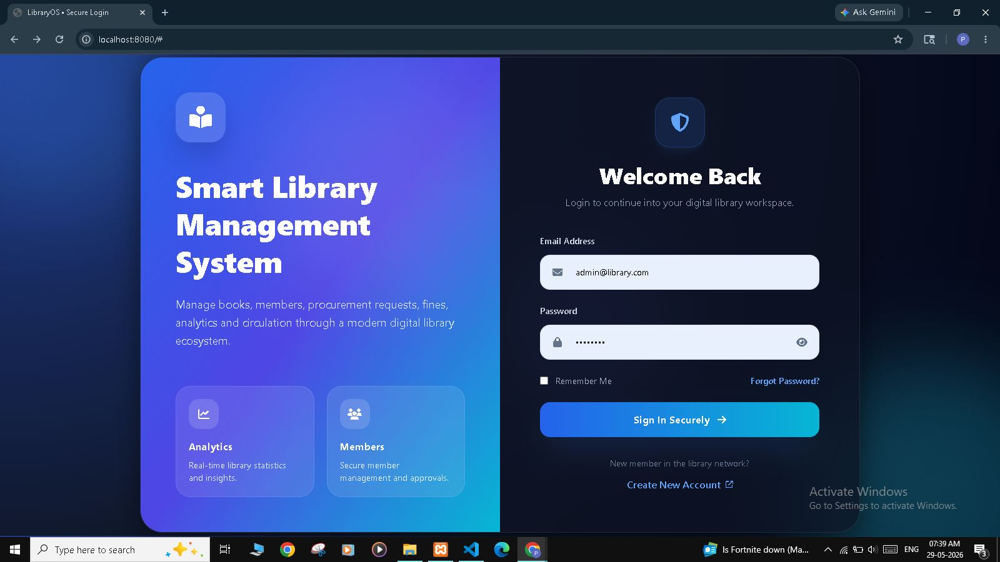
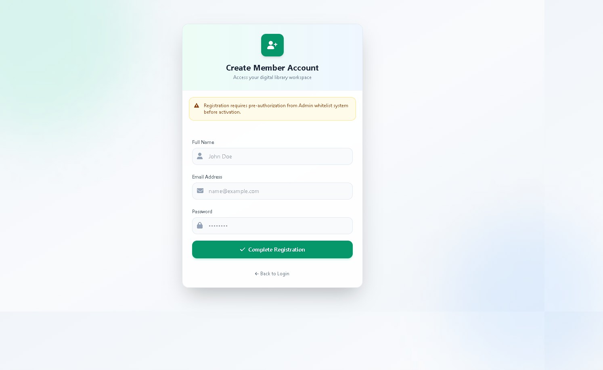
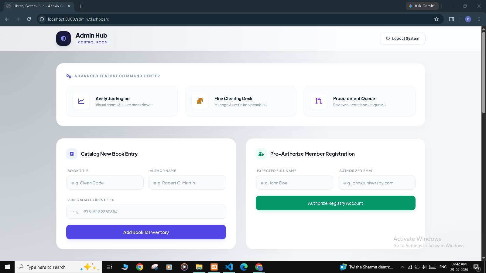
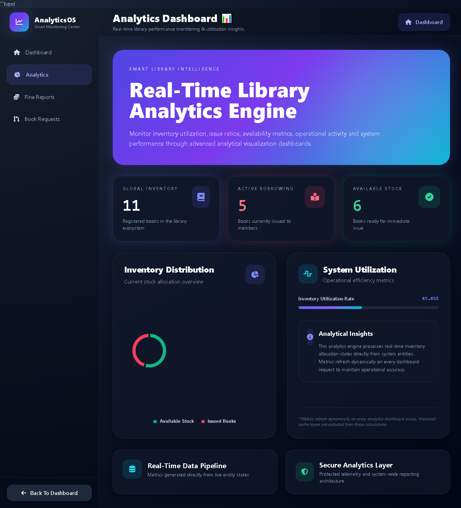
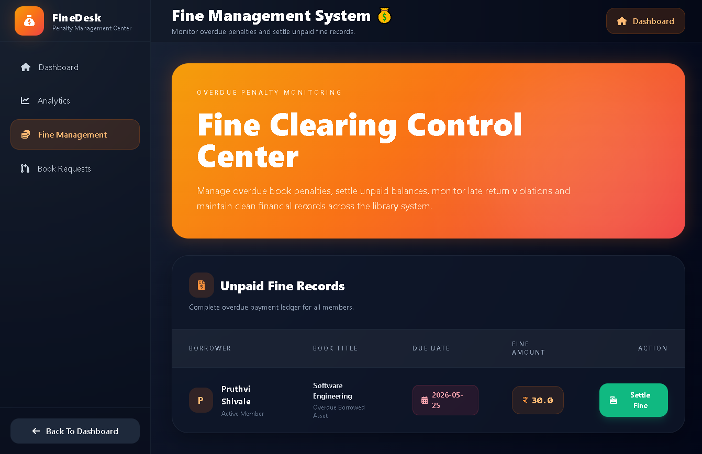
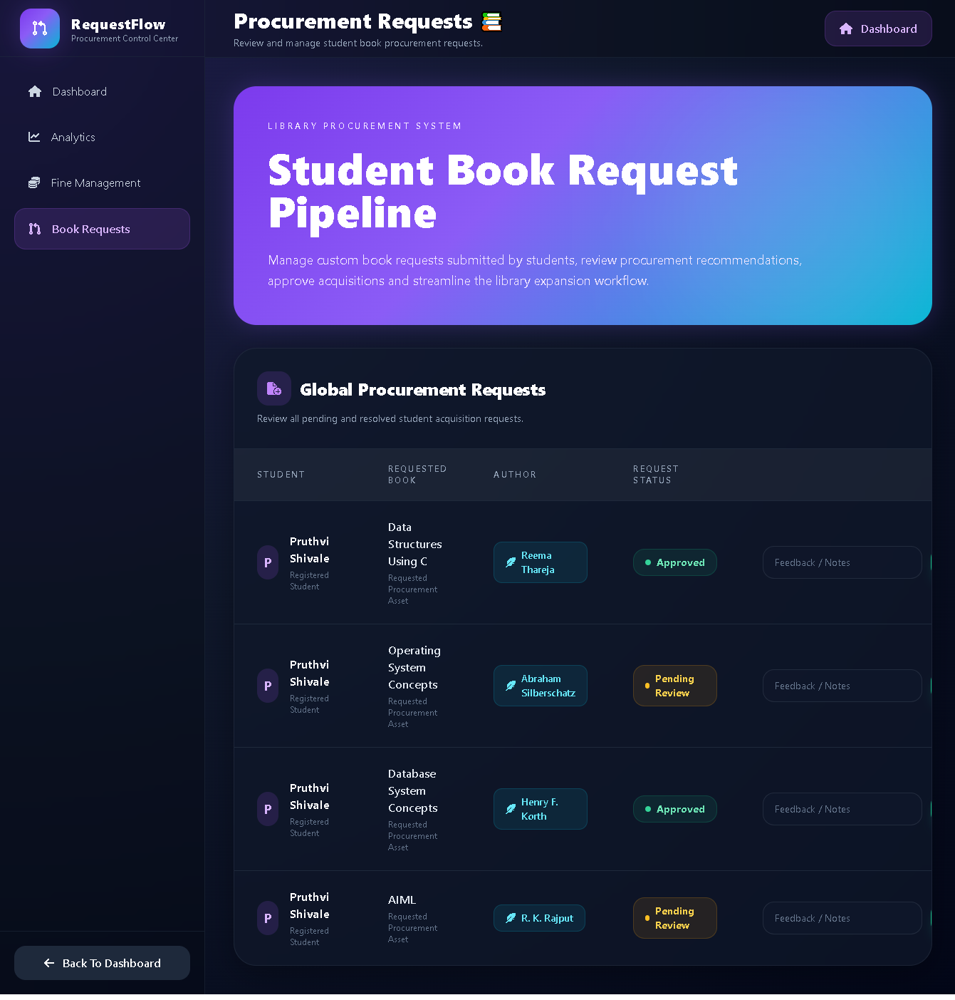
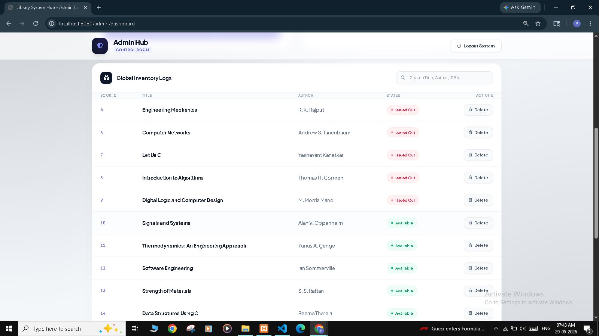
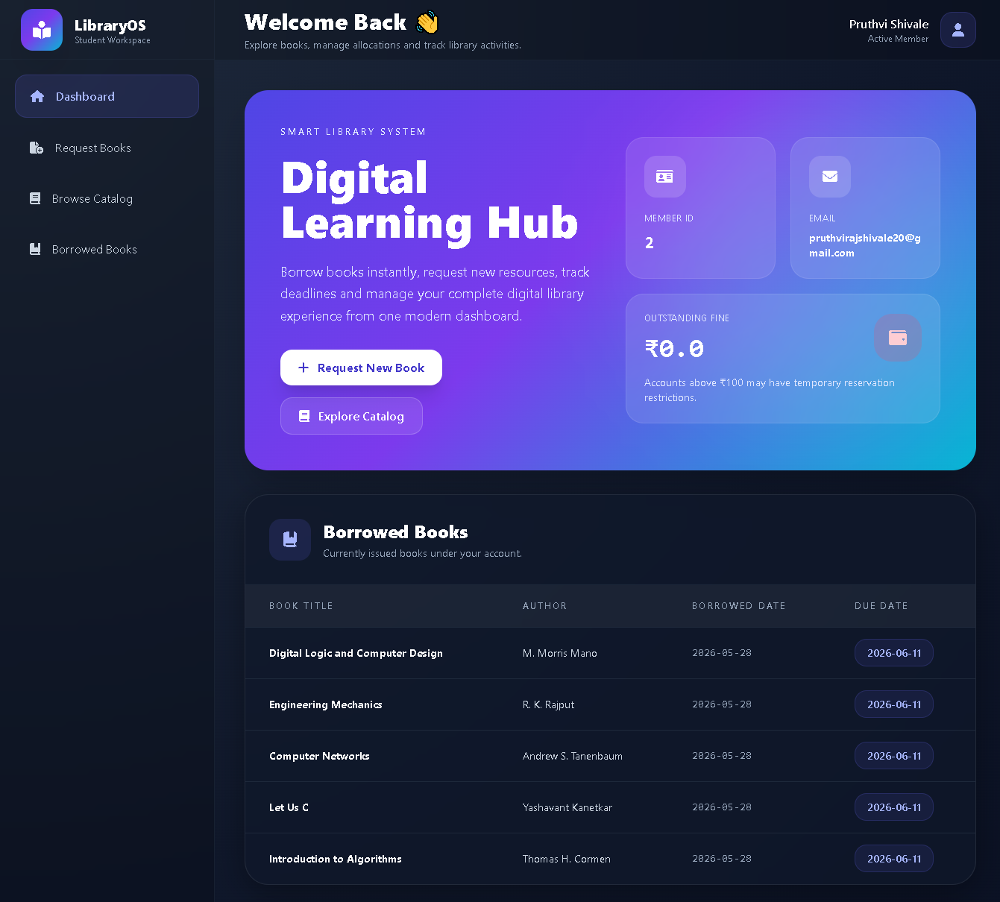
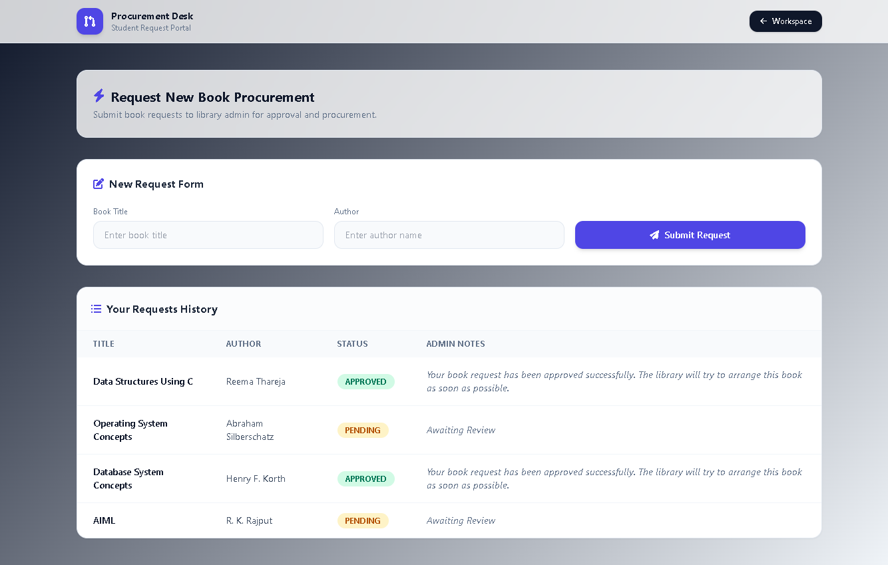

# 📚 Academic Library Management System

A full-stack Library Management System built using Spring Boot, MySQL (XAMPP), Thymeleaf, Tailwind CSS, and Spring Security.

The system provides secure role-based access for Admin and Members with features like book management, fine tracking, analytics dashboard, and book request system.

This is an academic project created for learning full-stack Java development and database integration.

---

## 🛠️ Technologies Used

- Java
- Spring Boot
- Spring MVC
- Spring Security
- Spring Data JPA
- Thymeleaf
- MySQL (XAMPP)
- Tailwind CSS
- HTML
- CSS
- JavaScript
- Chart.js
- FontAwesome

---

## ✨ Features

### 🔐 Authentication System
- Pre-registered Admin & Member system
- Role-based login (ADMIN / MEMBER)
- Secure authentication using Spring Security

### 🧑‍💼 Admin Features
- Admin Dashboard
- 📊 Analytics Dashboard (Books, Issued, Available + Charts)
- 💰 Fine Management System
- 📥 Procurement Requests (Approve/Reject)

### 👨‍🎓 Member Features
- Member Dashboard
- Profile Management
- Fine Status View
- Book Request System

---

## 🔄 System Workflow

- Admin pre-registers members
- User registers using credentials
- Login system verifies role
- Admin accesses dashboard
- Member accesses personal dashboard
- Members request books
- Admin approves/rejects requests
- System calculates fines automatically

---

## 📂 Project Structure

- Authentication Module
- Admin Dashboard Module
- Member Dashboard Module
- Analytics Module
- Fine Management Module
- Book Request Module

---

## 🗄️ Database

This project uses MySQL database via XAMPP.

Database Name:
```sql
CREATE DATABASE librarydb;
```
-Main Tables:
 Users
 Books
 Fines
 Requests

---

## Screenshots 

### Login Page





---


### Signup Page





---


### Admin Dashboard





---


### Admin Analytics





---


### Admin Fines





---


### Admin Requests





---


### Global Inventory Logs





---


### Member Dashboard





---


### Member Requests





---
## ▶️ How to Run

1. Clone Repository
```
git clone <https://github.com/PruthvirajShivale/library-management-system-springboot>
```

2. Open Project in IntelliJ / Eclipse / VsCode
3. Configure Database in application.properties
```
spring.datasource.url=jdbc:mysql://localhost:3306/librarydb
spring.datasource.username=root
spring.datasource.password=your_password
```

4. Run Project
```
mvn spring-boot:run
```
5. Open Browser
```
http://localhost:8080
```

---

## 🎯 Project Highlights
 -Secure Role-Based System
 -Automatic Fine Calculation
 -Real-time Analytics Dashboard
 -Clean UI using Tailwind CSS
 -Beginner-friendly Spring Boot project
 -Full-stack CRUD application

---

##👨‍💻 Author
Pruthviraj Shivale

---

## 📄 License

This project is created for academic learning purposes.
